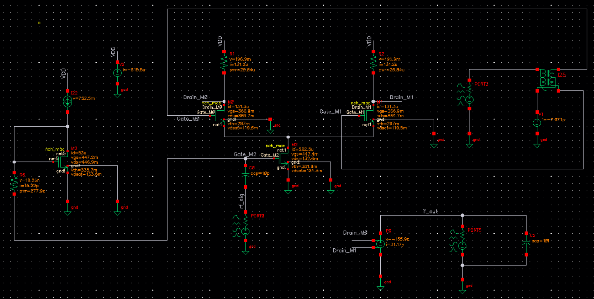

# Final Project: Single-Balanced Active Mixer Core

A single-balanced active mixer core simulated with $f_{\mathrm{RF}}=4.9\ \text{GHz}$ and $f_{\mathrm{LO}}=5.0\ \text{GHz}$, producing an IF component at

$$
f_{\mathrm{IF}} = |f_{\mathrm{LO}} - f_{\mathrm{RF}}| = 100\ \text{MHz}.
$$

The RF input is converted to a current by a transconductance stage, then an LO-driven differential switching pair commutates that current through the load resistors to generate the IF output. :contentReference[oaicite:7]{index=7}

> **Schematic**
> 

---

## Theory of Operation

### Frequency translation (single-balanced commutation)

With an LO-driven switching pair, the effective load polarity seen by the RF-derived current toggles at $f_{\mathrm{LO}}$, multiplying the RF signal by a periodic sign function. This creates sum and difference terms, with the desired downconverted component at $f_{\mathrm{IF}} = |f_{\mathrm{LO}} - f_{\mathrm{RF}}|$. :contentReference[oaicite:8]{index=8}

### Bias condition

The circuit uses $V_{DD}=1.2\ \text{V}$ to bias the LO switch gates and maintain the intended switching operation. :contentReference[oaicite:9]{index=9}

---

## Simulation Results

### Conversion gain vs RF input power

The measured conversion gain at $100\ \text{MHz}$ in the linear region is **11.7 dB**. :contentReference[oaicite:10]{index=10}

> **Conversion gain**
> 

### Operating point: RF device saturation

DC operating-point results confirm the RF input MOSFET remains in saturation:

$$
V_{DS} = 132.6\ \text{mV},\qquad V_{DSAT} = 124.3\ \text{mV},\qquad V_{DS} > V_{DSAT}.
$$

This verifies the mixer is correctly biased for small-signal transconductance behavior at the RF input. :contentReference[oaicite:11]{index=11}

> **Saturation check**
> 

---

## Files

- `Schematic.png` - Mixer schematic
- `Gain.png` - Conversion gain measurement
- `Saturation.png` - DC operating-point saturation verification
